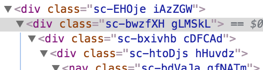
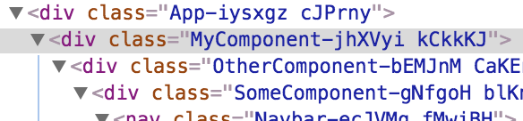

# @jukka/react-scripts

Forked from [Create React App](https://github.com/facebookincubator/create-react-app).

This version adds support for the following features:
- babel-plugin-styled-components
- react-hot-loader

## Styled components

Installing `styled-components` in a standard Create React App project will work but debugging is painful without the Webpack plugin.

* Without `babel-plugin-styled-components`, classnames are total gibberish:

* With `babel-plugin-styled-components`, they become human readable:

